---
presentation:
  # presentation 主题
  # === 可选的主题 ===
  # "beige.css"
  # "black.css"
  # "blood.css"
  # "league.css"
  # "moon.css"
  # "night.css"
  # "serif.css"
  # "simple.css"
  # "sky.css"
  # "solarized.css"
  # "white.css"
  # "none.css"
  theme: serif.css

  # The "normal" size of the presentation, aspect ratio will be preserved
  # when the presentation is scaled to fit different resolutions. Can be
  # specified using percentage units.
  width: 960
  height: 700

  # Factor of the display size that should remain empty around the content
  margin: 0.1

  # Bounds for smallest/largest possible scale to apply to content
  minScale: 0.2
  maxScale: 1.5

  # Display controls in the bottom right corner
  controls: true

  # Display a presentation progress bar
  progress: true

  # Display the page number of the current slide
  slideNumber: true

  # Push each slide change to the browser history
  history: false

  # Enable keyboard shortcuts for navigation
  keyboard: true

  # Enable the slide overview mode
  overview: true

  # Vertical centering of slides
  center: true

  # Enables touch navigation on devices with touch input
  touch: true

  # Loop the presentation
  loop: false

  # Change the presentation direction to be RTL
  rtl: false

  # Randomizes the order of slides each time the presentation loads
  shuffle: false

  # Turns fragments on and off globally
  fragments: true

  # Flags if the presentation is running in an embedded mode,
  # i.e. contained within a limited portion of the screen
  embedded: false

  mouseWheel: true

---

<!-- slide -->
## Review: How to go beyond the black-box simulation barrier 
Zihan Hu, Kai Su, Shiyu Zhao 
<!-- slide -->
### Recap
* Zero-knowledge
  There exists a probabilistic polynomial-time simulator S such that for every polynomial-sized circuit family $\{V_N^*\}_{n\in \mathbb{N}}$ and every sequence $\{(x_n,y_n)\}_{n\in \mathbb{N}}$, where $x_n\in \{0,1\}^n \cap L$ and $(x_n,y_n)\in R$, we have
  $$\left\{\operatorname{view}_{V_{n}^{*}}\left\langle P\left(x_{n}, y_{n}\right), V_{n}^{*}\left(x_{n}\right)\right\rangle\right\}_{n \in \mathbb{N}}\approx_C \left\{S(V_n^*,x_n)\right\}$$
   

<!-- slide -->
## General Idea

<!-- slide -->
### Key point of simulator
* Challenge
  * convince verifier without witness 
* Advantages
  * have access to random tape of verifier,    
  predict next question to ask
  * retry when it fails (called *rewinding* technique)

<!-- slide -->
### Why non-black-box
blackbox = verifier as an oracle
non-black-box = code of verifier
* Control randomness?
  verifier can hide randomness into algorithm (PRF, hash function)
  * random, uncontrollable if it's black-box
  * Reverse-engineering is hard and code can be well-obfuscated 
  still random, still uncontrollable even when it's non-black-box
* Rewinding(all zero-knowledge protocols)
    1. NO constant-round  zero-knowledge  proof  in  con-current composition
    2. NO constant-round  zero-knowledge  proof  in strict polynomial time

<!-- slide -->
### Why non-black-box
* Rewinding
''easy question'': The questions simulator can output answer successfully
Rewinding is just to **find** the ''easy question''

* **Key idea!**
What about modifying the definition of ''easy question''?
''easy question'' = ''what the verifier asks'' 
So it can be trivially answered

* How?
**
FLS technique!
**

<!-- slide -->
## FLS  Zero-Knowledge  Argument

<!-- slide -->
### FLS technique
* Idea
  a framework that allows using **trapdoor information** to cheat the verifier while verifier **does not know it is cheated** 
  
  * let **trapdoor information** to be the question verifier asks
  $\Rightarrow$ Knowing what the verifier asks is enough to convince/cheat the verifier
  $\Leftrightarrow$''easy question'' is just ''what the verifier asks'' as desired
  
  * Role of description: to define the ''easy question'' to be what the verifier asks

<!-- slide -->
### FLS technique
* Idea
* Witness-indistinguishable
  Let L = L(R) be some language and let (P, V) be an interactive argument for L. We say that (P, V) is witness-indistinguishable if for every polynomial-sized circuit family $\{V^*_n\}_{n\in \mathbb{N}}$ and every sequence ${(x_n, y_n, y'_n)}_{n\in \mathbb{N}}$, where $x_n \in \{0, 1\}_n$ and $(x_n, y_n), (x_n, y'_n) \in R$ , we have 
  $$\left\{\operatorname{view}_{V_{n}^{*}}\left\langle P\left(x_{n}, y_{n}\right), V_{n}^{*}\left(x_{n}\right)\right\rangle\right\}_{n \in \mathbb{N}}\approx_C \left\{\operatorname{view}_{V_{n}^{*}}\left\langle P\left(x_{n}, y'_{n}\right), V_{n}^{*}\left(x_{n}\right)\right\rangle\right\}_{n \in \mathbb{N}}$$
  *  Let the view of proving with witness for x and witness for trapdoor be indistinguishable $\Rightarrow$ verifier does not know it's cheated

<!-- slide -->
### FLS-type zero-knowledge protocol
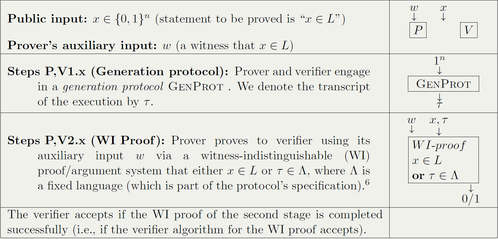
 Notice: In WI proof, $\langle x, \tau\rangle\in L'$ if either $x\in L$ or $\tau \in \Lambda$

<!--
### FLS technique
 

* Reduction
  * Aim: find an iteractive zero-knowledge proof for language $L\in NP$
  * Design a language $L'$ from $L$ ($\langle x, \tau\rangle\in L'$ if either $x\in L$ or $\tau \in \Lambda$)
  * Find a WI proof for $L'$ (universal arguments)
  * Use FLS technique to derive a zero-knowledge proof for $L$ from a WI proof for $L'$

### Generation protocol's properties

* Soundness
  * $Pr[\tau \in \Lambda]< \epsilon(n)$
  So that $\forall P^*$, if $x\notin L$, $Pr[\langle P^*,V\rangle(x)=1]<\epsilon(n)$
* Properly generated
  * $\exists S_{GenProt}$ that outputs $(v, \sigma)$ satisfying
    * $\left\{\operatorname{view}_{V_{n}^{*}}\left\langle P\left(x_{n}, y_{n}\right), V_{n}^{*}\left(x_{n}\right)\right\rangle\right\}_{n \in \mathbb{N}}\approx_{C} v$
    * $\tau \in \Lambda$ and $\sigma$ is the witness

### Proof: FLS-type protocol is zero-knowledge argument
* Completeness
  * If $x\in L$, then $\langle x, \tau\rangle \in L$
* Soundness
  * If $x\notin L$, since $Pr[\tau\in \Lambda]<\epsilon(n), Pr[x\in L \text{ or } \tau\in \Lambda]<\epsilon(n)$
* Zero-knowledge

### Proof: FLS-type protocol is zero-knowledge argument
* Zero-knowledge

-->

<!-- slide -->

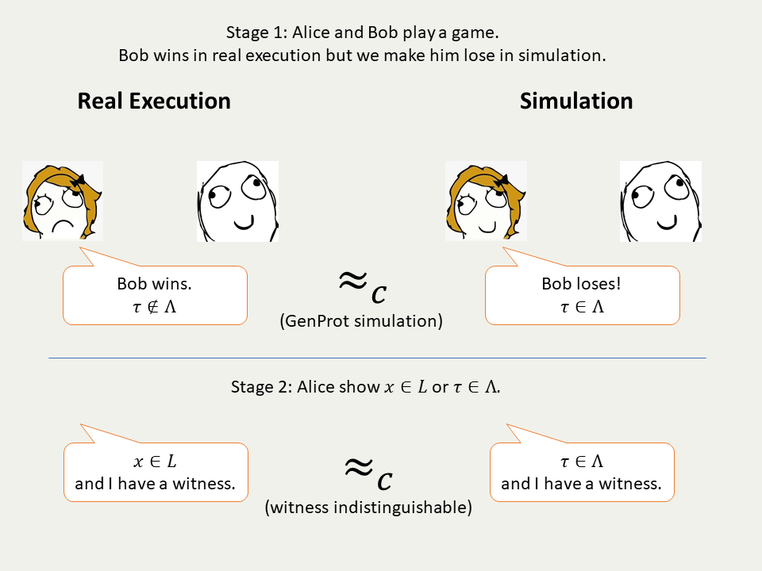

<!-- slide -->

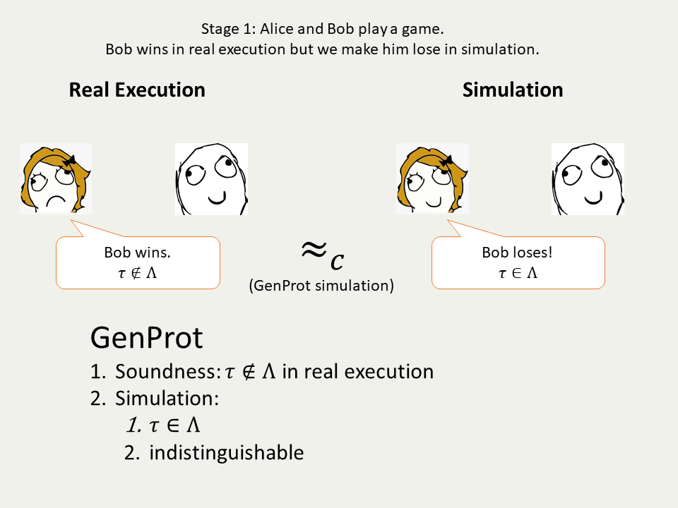

<!-- slide -->

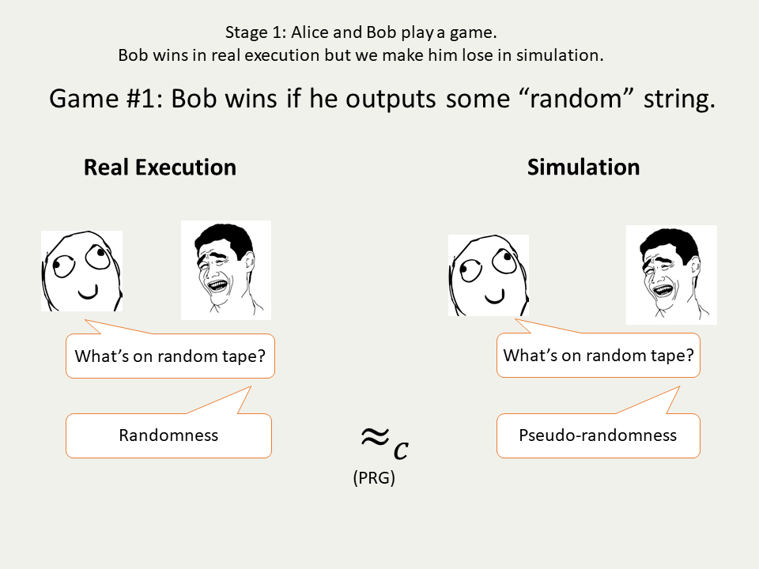

<!-- slide -->

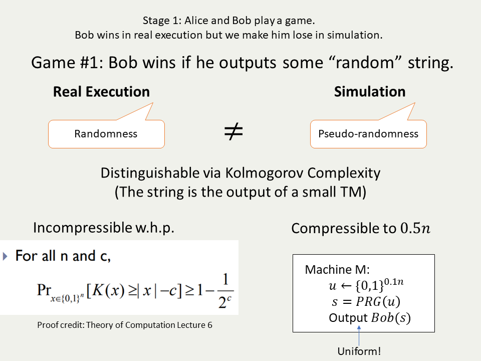

<!-- slide -->

Game #1: Bob wins if he outputs some “random” string.

$$
\begin{aligned}
\text{Prover}\xleftarrow{r}&\text{Verifier}\\
\end{aligned}\\
M:\text{a TM that outputs }r\\
\Lambda = \left\{r:\exists M,\left|M\right|<\frac{\left|r\right|}2,M()=r\text{ in }|r|^{\log\log|r|}\right\}
$$

<!-- slide -->

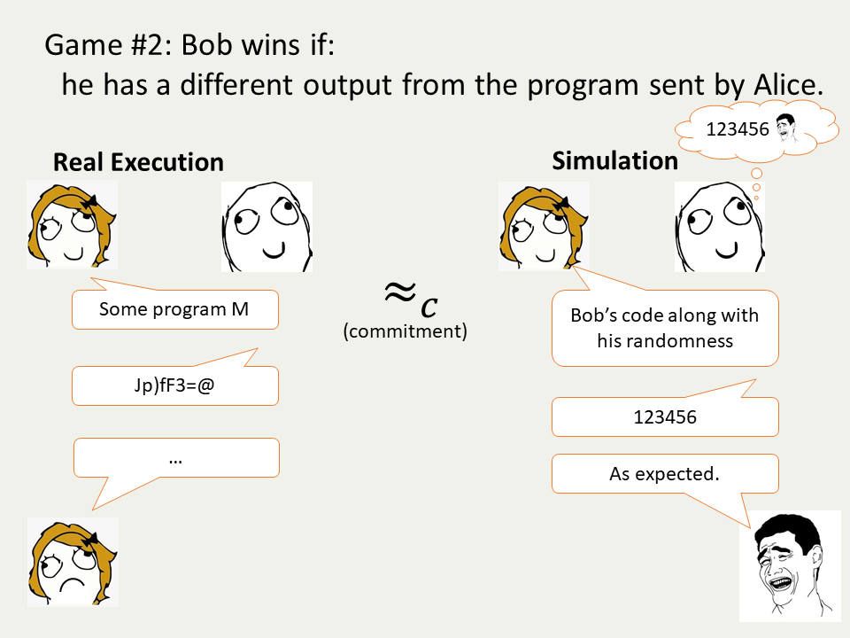

<!-- slide -->

Game #2: Bob wins if:
he has a different output from the program sent by Alice.

$$
\begin{aligned}
\text{Prover}\xrightarrow{z}&\text{Verifier}\\
\text{Prover}\xleftarrow{r}&\text{Verifier}\\
\end{aligned}\\
\Lambda = \left\{(z, r):\exists(s,\Pi),\text{Com}(\Pi;s) = z, \Pi(z) = r \text{ in } |r|^{\log\log|r|}\right\}
$$

<!-- slide -->

### Non-Uniform Verifier

<!-- slide -->

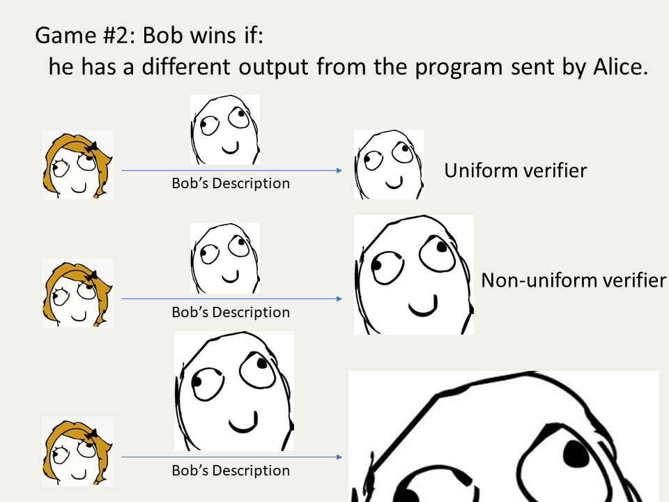

<!-- slide -->

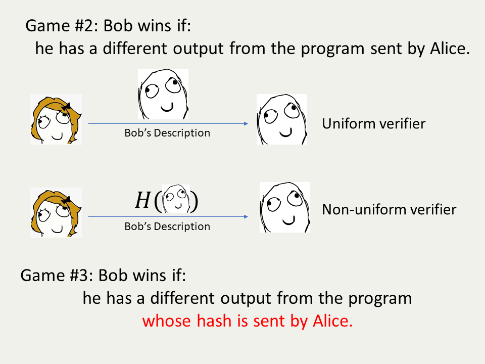

<!-- slide -->

Game #3: Bob wins if:
he has a different output from the program
whose hash is sent by Alice.

$$
\begin{aligned}
\text{Prover}\xleftarrow{h}&\text{Verifier}\\
\text{Prover}\xrightarrow{z}&\text{Verifier}\\
\text{Prover}\xleftarrow{r}&\text{Verifier}\\
\end{aligned}\\
\Lambda = \left\{(h, z, r):\exists (s, \Pi),\text{Com}(h(\Pi);s) = z, \Pi(z) = r \text{ in } |r|^{\log\log|r|}\right\}
$$

<!-- slide -->

  Sometimes prover proves related statements simultaneously...

<!-- slide -->

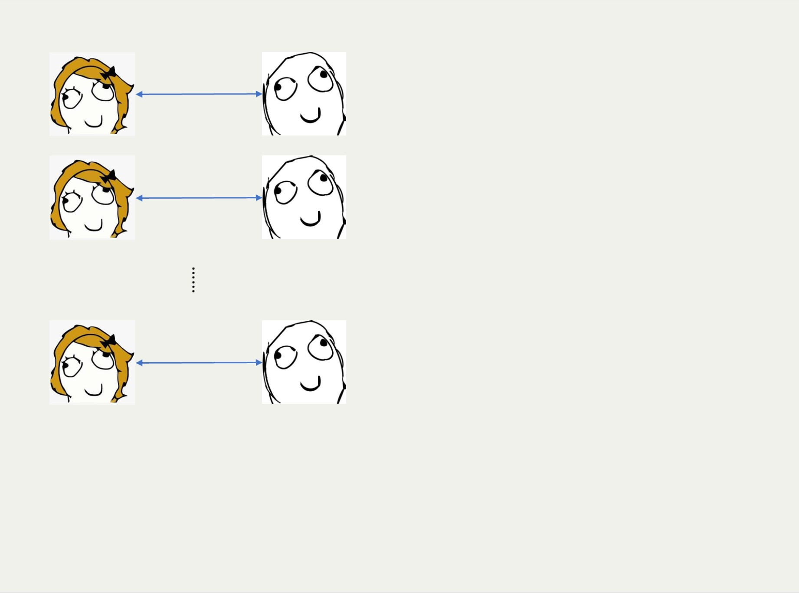

<!--### Definition
* $t$-times concurrent execution
​Run $t$ **independent** copies of $P$ with **one** verifier $V$ on $t$ instances. $V$ chooses which prover to ask at each time and is given the response from the corresponding prover.
 -->

<!-- slide -->

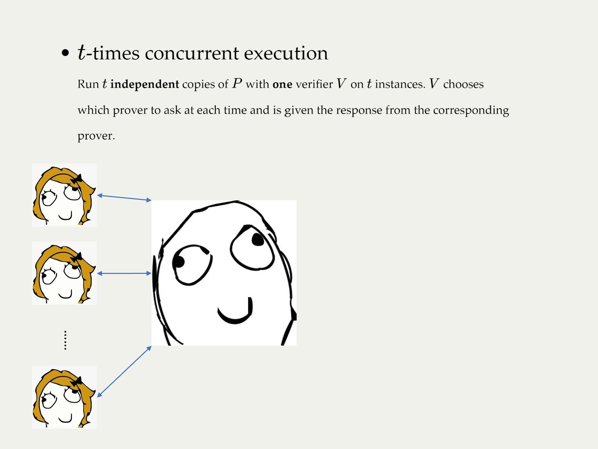

<!-- slide -->

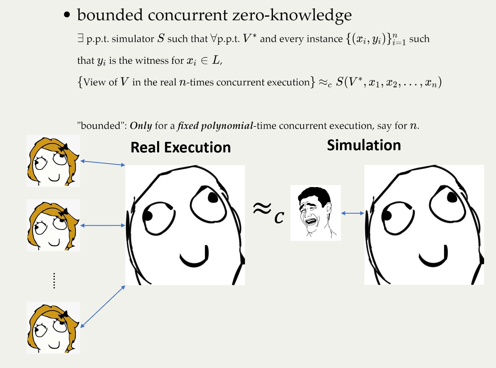

<!-- slide -->

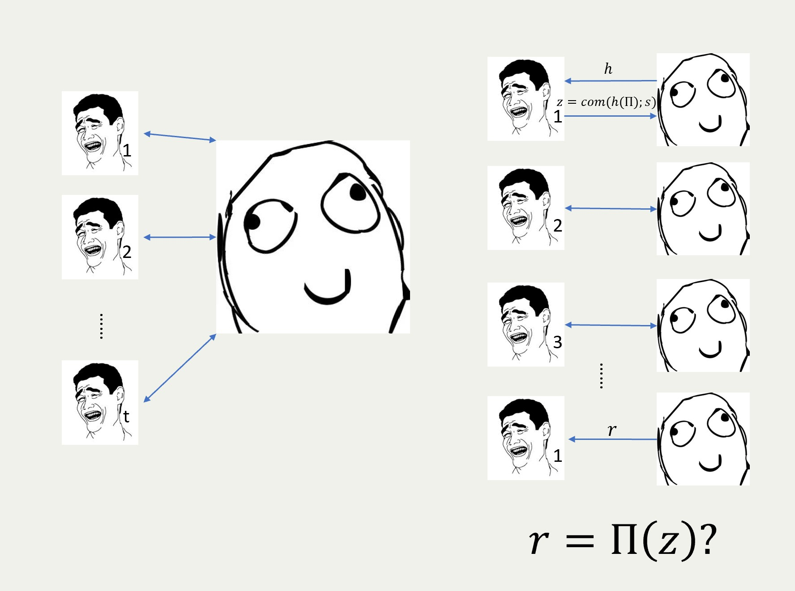

<!-- slide -->

$$\begin{aligned}
&\text{Prover}\xleftarrow{h}&\text{Verifier}\\
&\text{Prover}\xrightarrow{z}&\text{Verifier}\\
&\text{Prover}\xleftarrow{r}&\text{Verifier}\\
\end{aligned}\\$$

##### Non-uniform case

$\Lambda = \{(h, z, r):\exists(s, \Pi),\text{Com}(h(\Pi);s) = z, \Pi(z) = r \text{ in } |r|^{\log\log|r|}\}$

​                                                                         $\downarrow$
##### Bounded concurrent zero-knowledge case

$\Lambda = \{(h, z, r):\exists (s, \Pi,y),\text{Com}(h(\Pi);s) = z, \Pi(z,y) = r \text{ in } |r|^{\log\log|r|}\}$

<!-- slide -->

#### Proof Sketch

$\Lambda = \{(h, z, r)|\exists (s, \Pi,y),\text{Com}(h(\Pi);s) = z, \Pi(z,y) = r \text{ in } |r|^{\log\log|r|}\}$

*  Simulator: two parts 
  * $S_{GenProt}$ generates the view of generation protocol (the first stage) and the trapdoor information $(s, \Pi, y)$ along with $(h, z, r)$

  * $S_{WI}$ generates the view of witness indistinguishable universal argument (the second stage)

*  Completeness (trivial)

*  Soundness

<!-- slide -->

#### Proof Sketch (Cont'd)

$\Lambda = \{(h, z, r)|\exists (s, \Pi,y),\text{Com}(h(\Pi);s) = z, \Pi(z,y) = r \text{ in } |r|^{\log\log|r|}\}$

*  Simulator

*  Completeness (trivial)

*  Soundness
If verifier will be convinced with non-negligible probability for random $r$, 
consider random $r \ne r'$, 
$\text{Com}(h(\Pi);s) = z, \Pi(z,y) = r$, $\text{Com}(h(\Pi');s') = z, \Pi'(z,y') = r'$
$\Rightarrow h(\Pi) = h(\Pi')$, if $|y| < \frac{|r|}{2}$, $\Pi \ne \Pi'$

<!-- slide -->

##### Non-uniform case

$\Lambda = \{(h, z, r)|\exists(s, \Pi),\text{Com}(h(\Pi);s) = z, \Pi(z) = r \text{ in } |r|^{\log\log|r|}\}$

​                                                                         $\downarrow$
##### Bounded concurrent zero-knowledge case

$\Lambda = \{(h, z, r)|\exists (s, \Pi,y), |y| < \frac{|r|}{2}, \text{Com}(h(\Pi);s) = z, \Pi(z,y) = r \text{ in } |r|^{\log\log|r|}\}$

<!-- slide -->

### Summary

Assuming the existence of CRH (against some adversaries), there is a zero-knowledge argument system for NP satisfying the following properties:

* negligible soundness error 
* for non-uniform $V^*$ 
* constant rounds and public coin

* bounded concurrent zero-knowledge

* strict polynomial time simulator

<!-- slide -->

### Subsequent work

 why we need CRH against a super polynomial adversary?
 

<!-- slide -->

### Subsequent work

 why we need CRH against a super polynomial adversary?

 based on more standard assumption?

 [BG01] Suppose CRH against ***polynomial***-sized adversary exists, universal argument and witness-indistinguishable universal argument exist. Furthermore, these proof systems are of ***public coin*** type and use a ***constant*** number of rounds.
 

<!-- slide -->

#### Proof Sketch

* universal argument: via PCP

* + witness indistinguishable: via concurrent execution of "encrypt" version of universal argument + constant error soundness zero-knowledge proof

* how to use in this work: 
  * hope that a random bit is different (via error correcting code)
  * hope that we can decommit to a single bit (via tree commitment)

<!-- slide -->

### Future directions

*  Non-black-box proofs of security

*  Black box reduction and non-black box reduction

*  Arguments vs. proof

*  Fiat-Shamir heuristic

<!-- slide -->

## Thank you!
